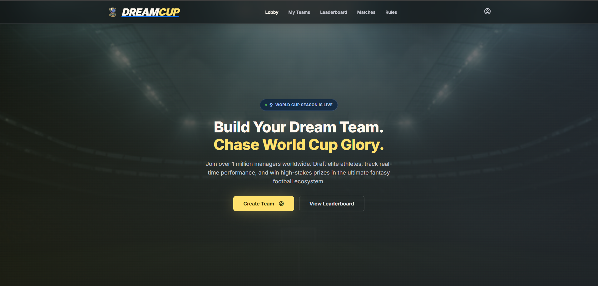
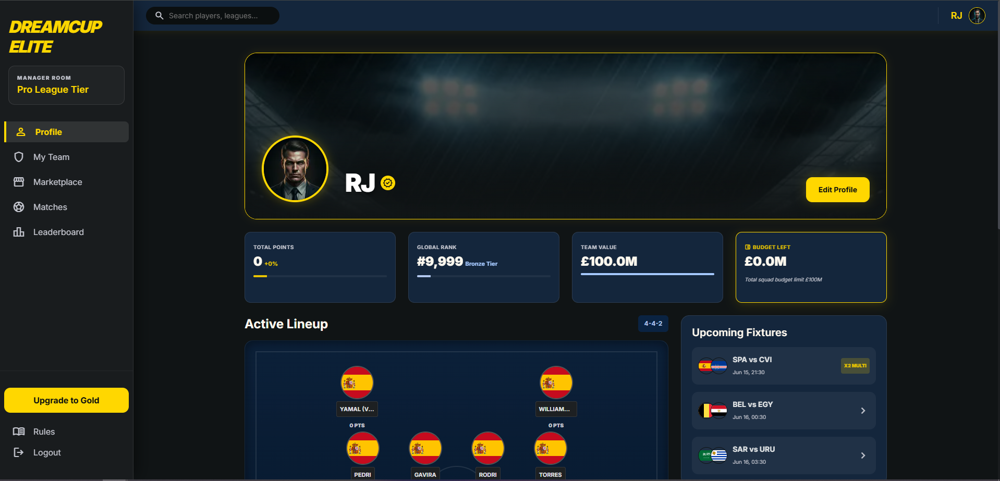
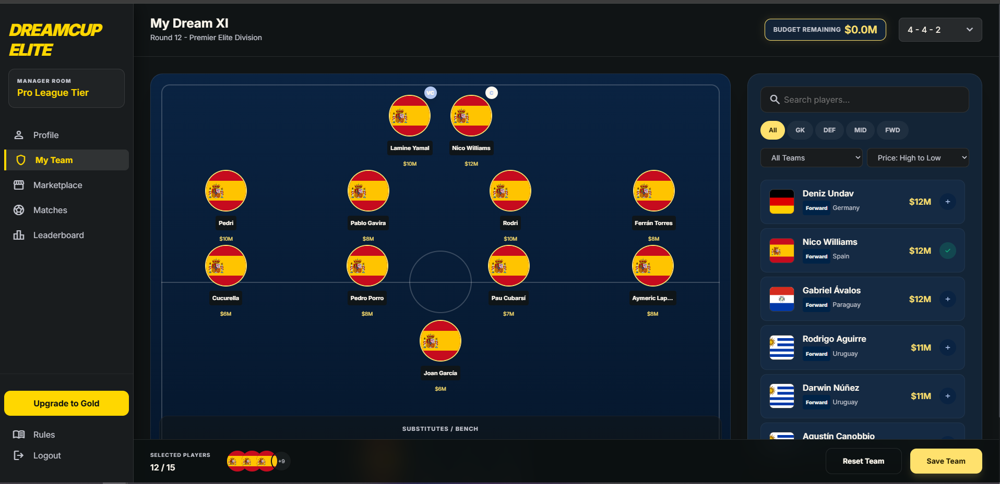
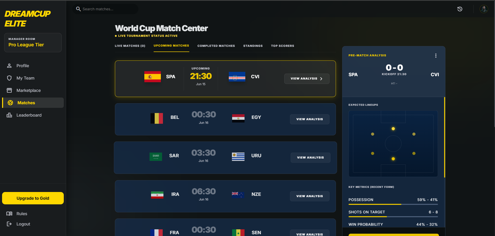
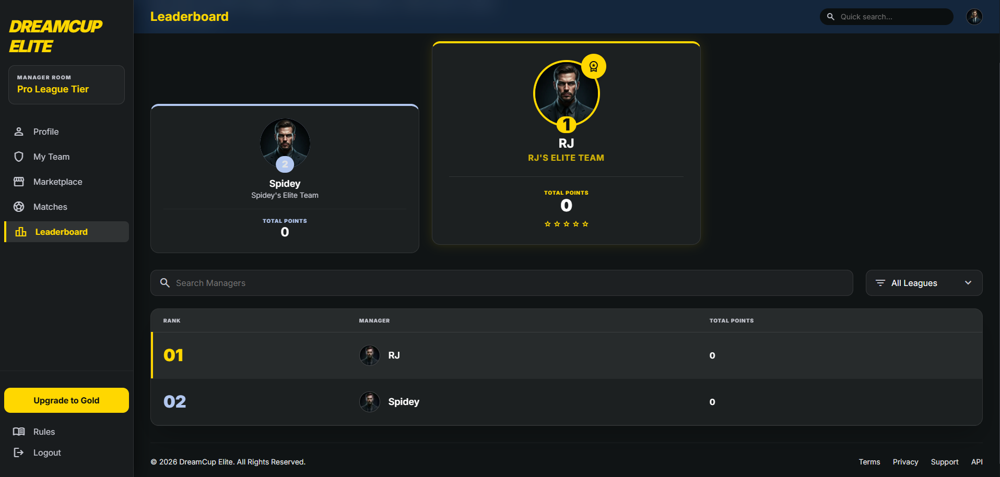

# DreamCup - Fantasy Football Platform

DreamCup is a full-stack fantasy football platform that allows users to create their dream team, manage budgets, select captains, track live World Cup matches, and compete on leaderboards.

## Live Demo

https://dreamcup.vercel.app/

---

## Features

### Authentication

* User Registration
* User Login
* JWT Authentication
* Protected Routes

### Fantasy Team Management

* Build your fantasy football team
* Add and remove players
* Budget management system
* Captain selection
* Vice Captain selection
* Team validation rules

### Fantasy Gameplay

* Fantasy points system
* Team points calculation
* Dynamic leaderboard
* Player performance tracking

### World Cup Match Center

* Live Matches
* Upcoming Fixtures
* Match Results
* Group Standings
* Top Scorers
* Match Details
* My Players In Match

### Player Marketplace

* Search Players
* Filter by Position
* Filter by Team
* Sort by Price
* Real Player Profiles
* 1200+ International Players

---

## Tech Stack

### Frontend

* Next.js (Pages Router)
* React.js
* SCSS Modules
* Axios
* React Hot Toast

### Backend

* Node.js
* Express.js
* JWT Authentication
* REST API Architecture

### Database

* MongoDB Atlas
* Mongoose ODM

### External APIs

* football-data.org API

### Deployment

* Vercel (Frontend)
* Railway (Backend)
* MongoDB Atlas (Database)

---

## Project Architecture

```bash
Frontend (Next.js)
        │
        ▼
Backend API (Express.js)
        │
        ▼
MongoDB Atlas
        │
        ▼
football-data.org API
```

## Database Collections

### Users

```javascript
{
  name,
  email,
  password
}
```

### Players

```javascript
{
  name,
  team,
  position,
  price,
  points,
  image,
  countryFlag
}
```

### Fantasy Teams

```javascript
{
  userId,
  players,
  captain,
  viceCaptain,
  budgetRemaining,
  totalPoints
}
```

---

## Installation

### Clone Repository

```bash
git clone https://github.com/abinabhi007/DreamCup.git
```

### Install Frontend

```bash
cd frontend
npm install
npm run dev
```

### Install Backend

```bash
cd backend
npm install
npm run dev
```

---

## Environment Variables

### Backend

```env
PORT=5000

MONGO_URI=your_mongodb_connection_string

JWT_SECRET=your_jwt_secret

FOOTBALL_DATA_API_KEY=your_football_data_api_key

FRONTEND_URL=http://localhost:3000

RELAY_SECRET=your_relay_secret
```

### Frontend

```env
NEXT_PUBLIC_API_URL=http://localhost:5000

EMAIL_USER=your_email
EMAIL_PASS=your_password
RELAY_SECRET=your_secret
```

---

## Key Features Implemented

* Full JWT Authentication System
* Fantasy Team Builder
* Budget Validation
* Captain & Vice Captain Logic
* World Cup Match Integration
* Live Scores & Fixtures
* Leaderboard Ranking System
* Dynamic Team Filtering
* Match Analysis Dashboard
* Responsive Design

---

## Screenshots

### Landing Page



### Dashboard



### Fantasy Team Builder



### Match Center



### Leaderboard



---

## 🔮 Future Enhancements

* Real-Time Fantasy Points Automation
* Transfer Window System
* Match Notifications
* Player Price Fluctuation
* User Avatars
* Tournament Prediction System
* Admin Dashboard
* Multi-League Support

---

## Author

**Abin HN**

* LinkedIn: [https://www.linkedin.com/in/abin-hn-b3a30a278/](https://www.linkedin.com/in/abin-hn-b3a30a278/)
* GitHub: [https://github.com/abinabhi007](https://github.com/abinabhi007)

---

## Support

If you found this project useful, consider giving it a star on GitHub.
